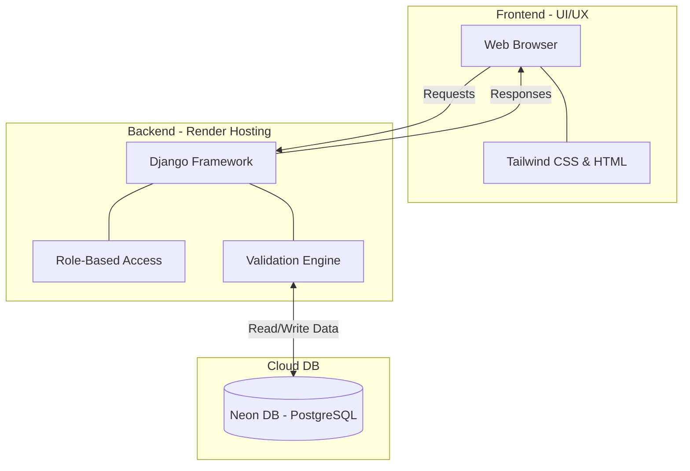
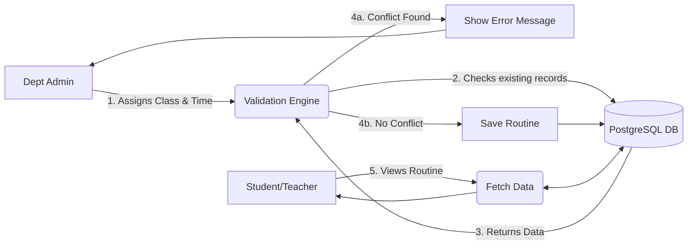

# 📅 University Routine Management System (SRMS)

**A Project By:**
* Raisul Islam (223071051)
* Sharmin Akter Ritu (223071076)

## 🚀 Overview
The **University Routine Management System** is a robust, full-stack web application designed to automate and optimize the process of class scheduling. It eliminates manual errors, prevents scheduling conflicts, and provides a seamless real-time routine viewing experience for students and faculty.

## 💡 Solution to Existing Problems (Unique Ideas)
* **Conflict-Free Scheduling:** An integrated validation engine (Rule-based heuristic logic) ensures no two classes are assigned to the same room or teacher at the same time.
* **Role-Based Access Control:** Secure boundaries between Faculty Admins, Department Admins, and general users.
* **Exceptional UI/UX:** Built with Tailwind CSS, ensuring a responsive, modern, and intuitive interface across all devices.

## 🛠️ Tech Stack (Full Stack)
* **Backend:** Python, Django
* **Database:** PostgreSQL (Serverless via Neon DB)
* **Frontend:** HTML5, Tailwind CSS
* **Deployment:** Render.com

---

## ⚙️ System Architecture Flowchart



---

## 🔄 Data Flow Diagram (Conflict Validation Logic)



---

## 📂 Project Structure
```text
URMS_WORKSPACE/
├── routines/               # Main App (Models, Views, Controllers)
│   ├── migrations/         # Database migrations
│   ├── templates/          # UI / HTML files (Tailwind integrated)
│   ├── models.py           # Database Schema (Course, Room, Teacher, Routine)
│   └── views.py            # Business Logic & Validation Engine
├── urms_project/           # Project Configuration
│   ├── settings.py         # App settings & DB Config
│   └── wsgi.py             # Web Server Gateway Interface
├── staticfiles/            # Compiled static assets
├── .env                    # Environment Variables (Ignored in Git)
├── Procfile                # Deployment instructions for Render
└── requirements.txt        # Python dependencies
```

## 🌐 Live Demo
You can access the live working application here:
**[View Live Website](https://urms-workspace.onrender.com/)**

## 🚀 How to Run Locally
1. Clone the repository: `git clone <your-repo-link>`
2. Install dependencies: `pip install -r requirements.txt`
3. Setup `.env` file with your DB credentials.
4. Run migrations: `python manage.py migrate`
5. Start server: `python manage.py runserver`